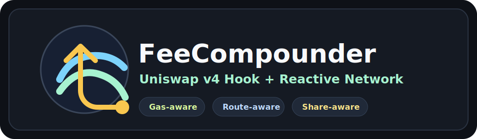
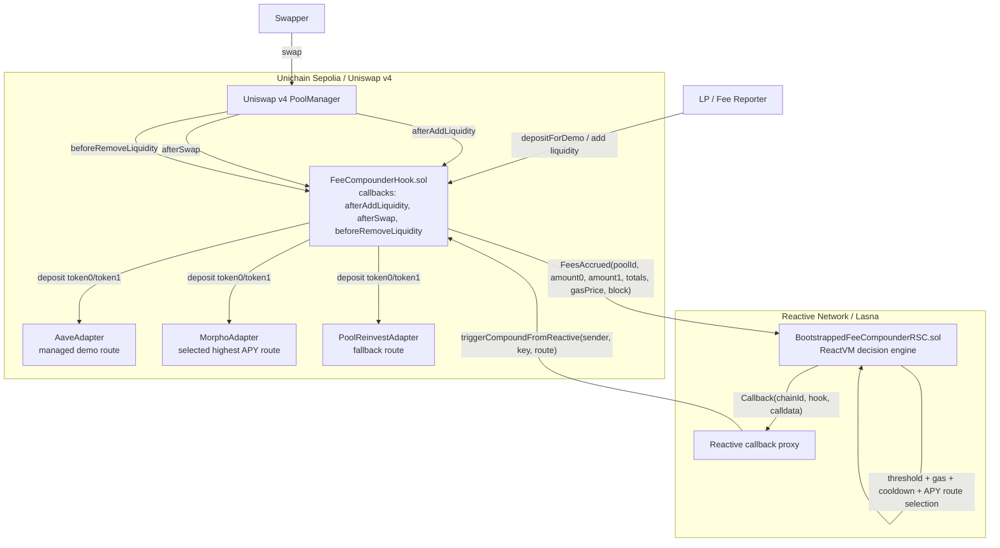
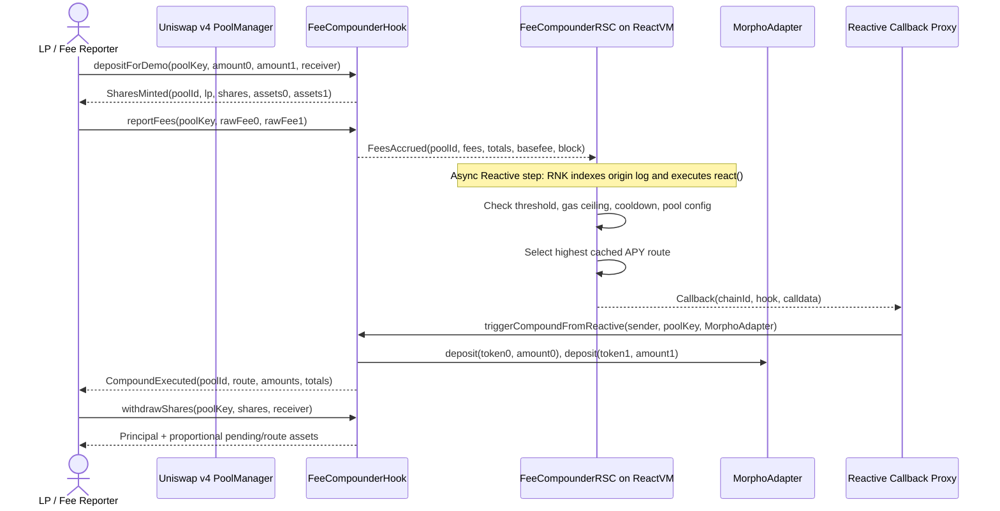
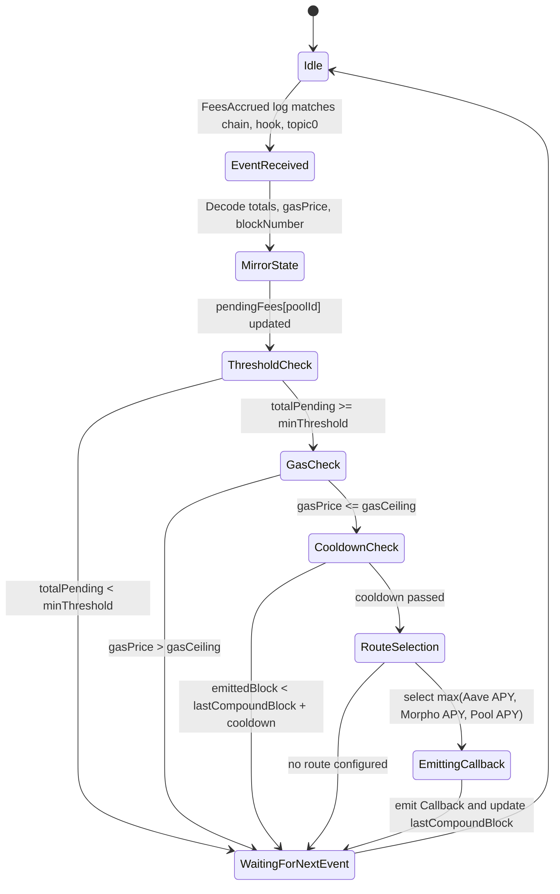
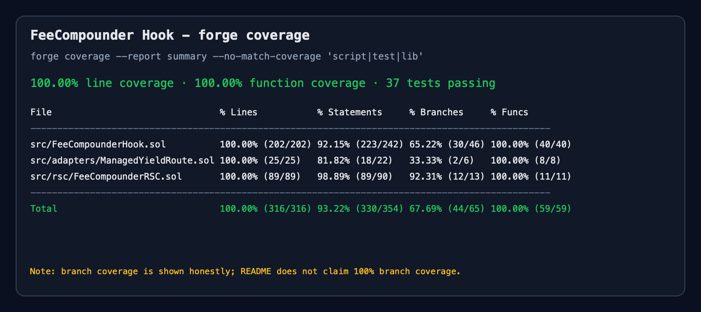

# 🧪 FeeCompounder Hook

*Beefy-style fee compounding inside a Uniswap v4 hook, driven by Reactive Network.*

        



---

FeeCompounder Hook is Hook 5 of 8 in the Najnomics UHI9 Hookathon lineup, owned by Friend B under the Najnomics team. It captures a configurable slice of LP fee flow, accounts for LP ownership with shares, and compounds accumulated fees into the best configured yield route when Reactive Network says the tradeoff is worth it. The implementation differs from simple auto-compounders by separating fee accrual from execution, proving the event-to-callback path through a Reactive Smart Contract, and preserving proportional LP accounting across deposits, compounding, and withdrawals. Built for the UHI9 Hookathon — Impermanent Loss & Yield Systems.

**Presentation:** https://gamma.app/docs/FeeCompounder-iovsvmuozm9c3jh  
**Demo Video:** https://youtu.be/TtFMdKXqvRs

## Integration Banner

> ⚛️ **Reactive Network Integration**  
> FeeCompounder Hook is powered by Reactive Smart Contracts (RSCs) deployed on Reactive Network. RSCs autonomously monitor on-chain events from Uniswap v4 and trigger callbacks without keepers, bots, or manual intervention. In this project, the RSC watches `FeesAccrued` events, applies threshold/gas/cooldown gates, selects the highest-APY configured route, and calls the hook back through the Reactive callback proxy.

## Table of Contents

- [The Problem](#the-problem)
- [The Solution](#the-solution)
- [Architecture](#architecture)
  - [System Overview Diagram](#system-overview-diagram)
  - [User Journey Diagram](#user-journey-diagram)
  - [RSC State Transition Diagram](#rsc-state-transition-diagram)
- [Core Components](#core-components)
- [Reactive Network Integration](#reactive-network-integration)
- [Demo Run](#demo-run)
- [Test Coverage](#test-coverage)
- [Local Development](#local-development)
- [Contributing & License](#contributing--license)
- [Acknowledgements](#acknowledgements)

## The Problem

Uniswap v4 LPs earn fees as trading happens, but those fees do not automatically become productive capital. LPs must decide when to collect, when to reinvest, and whether to route fees back into the same pool or into another yield source. That creates idle capital, operational overhead, and a timing problem: manual compounding is often done when it is convenient for the LP, not when gas and yield conditions make economic sense.

Prior hook work has explored adjacent ideas. FlexFee-style hooks focus on changing fee levels, Gainswap-style systems explore richer trading surfaces, xtreamly focuses on liquidity management, and idle-liquidity projects such as Idle Liquidity Yield Hook and YieldSync route unused capital toward yield. Those approaches are useful, but they do not combine fee-reserve accounting, gas-aware execution, yield-route selection, and autonomous event-driven callbacks in one hook.

The gap is an LP fee engine that behaves more like a vault strategist while staying inside the Uniswap v4 hook lifecycle. FeeCompounder fills that gap by letting fees accumulate in a hook-owned reserve, proving ownership through shares, and using Reactive Network to trigger compounding only after objective conditions pass.

**FeeCompounder Hook solves this by turning idle fee flow into a share-accounted reserve that an RSC compounds into the best configured route when threshold, gas, and cooldown gates pass.**

## The Solution

FeeCompounder Hook intercepts a configurable basis-point slice of reported fee flow and stores it as pending fees per pool. LP deposits mint proportional shares, so a new LP entering after previous compounding receives a fair share amount instead of diluting earlier LPs. When pending fees are large enough, the RSC selects between Aave-style, Morpho-style, and pool-reinvest routes and calls the hook to compound through a whitelisted adapter.

The hook itself remains conservative: it stores accounting, enforces access control, verifies Reactive callback provenance, and executes the selected route. The RSC holds the automation policy: event subscription, pending-fee mirror state, gas ceiling, cooldown, APY comparison, and callback emission. This split keeps the destination hook simple while making the strategy autonomous.

1. An LP deposits demo-backed token inventory into the hook and receives pool-specific shares.
2. Fee activity is reported into the hook, which transfers the compounding slice and emits `FeesAccrued`.
3. The Reactive RSC observes `FeesAccrued` from the configured hook and pool.
4. ReactVM checks pending fees, observed gas price, cooldown, pool configuration, and route availability.
5. ReactVM selects the configured route with the highest cached APY.
6. The RSC emits a Reactive `Callback` to `triggerCompoundFromReactive(address,PoolKey,address)`.
7. The hook authenticates the callback proxy plus RVM sender, deposits pending fees into the route, and emits `CompoundExecuted`.

> ⚖️ **Risk Accounting:** LPs retain normal Uniswap LP market and impermanent-loss risk; the hook only controls the intercepted compounding slice and routes it to whitelisted adapters.

## Architecture

### System Overview Diagram



### User Journey Diagram



### RSC State Transition Diagram



## Core Components

### FeeCompounderHook.sol

`FeeCompounderHook.sol` is the destination-chain Uniswap v4 hook that tracks LP shares, accrues fee reserves, verifies Reactive callbacks, and compounds pending fees into whitelisted routes.

| Function | Visibility | Description |
| --- | --- | --- |
| `getHookPermissions()` | `public pure` | Declares the v4 callbacks used by the hook. |
| `poolId(PoolKey)` | `public pure` | Computes the internal `bytes32` pool identifier used by hook and RSC. |
| `pendingFeesFor(bytes32)` | `external view` | Returns pending token0/token1 fees for a pool. |
| `lpBalance(bytes32,address)` | `external view` | Converts LP shares into current asset claims. |
| `sharesToAssets(bytes32,uint256)` | `public view` | Converts a share amount into token0/token1 assets. |
| `assetsToShares(bytes32,uint256,uint256)` | `public view` | Converts token0/token1 assets into pool shares. |
| `reportFees(PoolKey,uint256,uint256)` | `external` | Pulls the compounding slice of reported fees and emits `FeesAccrued`. |
| `depositForDemo(PoolKey,uint256,uint256,address)` | `external` | Demo deposit path that mints share-accounted LP claims. |
| `withdrawShares(PoolKey,uint256,address)` | `external` | Burns LP shares and returns proportional assets. |
| `triggerCompound(PoolKey,address)` | `external` | Direct demo/operator compound path restricted to `directCompoundCaller`. |
| `triggerCompoundFromReactive(address,PoolKey,address)` | `external` | Reactive callback entrypoint restricted by callback proxy and RVM sender. |
| `pay(uint256)` | `external` | Lets the callback proxy pull payment from the hook. |
| `coverCallbackDebt()` | `external` | Pays outstanding callback proxy debt from hook native balance. |
| `setReactiveAuth(address,address,address)` | `external onlyOwner` | Updates callback proxy, RVM sender, and direct caller. |
| `setAdapterWhitelisted(address,bool)` | `external onlyOwner` | Adds or removes a yield route adapter. |
| `setDefaultRoute(address)` | `external onlyOwner` | Sets the max-hold fallback route. |

| Variable | Type | Description |
| --- | --- | --- |
| `pools` | `mapping(bytes32 => PoolAccounting)` | Per-pool shares, assets, pending fees, route shares, and route state. |
| `lpShares` | `mapping(bytes32 => mapping(address => uint256))` | LP share balances by pool. |
| `lpEntryBlock` | `mapping(bytes32 => mapping(address => uint256))` | LP entry block by pool. |
| `whitelistedAdapters` | `mapping(address => bool)` | Route whitelist enforced before compounding. |
| `owner` | `address` | Admin for configuration and adapter whitelist. |
| `callbackProxy` | `address` | Authorized Reactive callback proxy on the destination chain. |
| `reactiveSender` | `address` | Expected RVM sender encoded in callback calldata. |
| `directCompoundCaller` | `address` | Demo/direct operator allowed to call `triggerCompound`. |
| `feeReporter` | `address` | Address allowed to call `reportFees`. |
| `defaultRoute` | `address` | Fallback route used by max-hold force compounding. |
| `compoundFeeBps` | `uint256` | Basis-point slice of reported fees captured for compounding. |

Hook permissions used:

- ❌ `beforeInitialize`
- ❌ `afterInitialize`
- ❌ `beforeAddLiquidity`
- ✅ `afterAddLiquidity`
- ✅ `beforeRemoveLiquidity`
- ❌ `afterRemoveLiquidity`
- ❌ `beforeSwap`
- ✅ `afterSwap`
- ❌ `beforeDonate`
- ❌ `afterDonate`
- ❌ `beforeSwapReturnDelta`
- ❌ `afterSwapReturnDelta`
- ❌ `afterAddLiquidityReturnDelta`
- ❌ `afterRemoveLiquidityReturnDelta`

### FeeCompounderRSC.sol

`FeeCompounderRSC.sol` is the Reactive Smart Contract that mirrors pending-fee state, applies compounding gates, selects the best route, and emits the destination callback.

| Function | Visibility | Description |
| --- | --- | --- |
| `configureSubscription()` | `external onlyAdmin` | Registers the FeesAccrued subscription on Reactive Network. |
| `configurePool(bytes32,PoolKey)` | `external onlyAdmin` | Stores the pool key needed for callback calldata. |
| `configureRoutes(address,address,address)` | `external onlyAdmin` | Stores Aave, Morpho, and pool-reinvest route addresses. |
| `updateAPYs(uint256,uint256,uint256)` | `external onlyAdmin` | Updates cached APY values used for route selection. |
| `setDecisionConfig(uint256,uint256,uint256)` | `external onlyAdmin` | Updates threshold, gas ceiling, and cooldown gates. |
| `react(LogRecord)` | `external vmOnly` | ReactVM entrypoint that validates the log, decodes event data, evaluates gates, and emits `Callback`. |

| Variable | Type | Description |
| --- | --- | --- |
| `FEES_ACCRUED_TOPIC` | `uint256 constant` | Topic0 for `FeesAccrued(bytes32,uint256,uint256,uint256,uint256,uint256,uint256)`. |
| `DESTINATION_CHAIN_ID` | `uint256 immutable` | Destination chain where the hook is deployed. |
| `HOOK_ADDRESS` | `address immutable` | Hook contract monitored by the RSC. |
| `CALLBACK_GAS_LIMIT` | `uint64 immutable` | Gas limit attached to Reactive callback delivery. |
| `SUBSCRIPTION_ADMIN` | `address immutable` | Address allowed to configure RSC parameters. |
| `CALLBACK_SENDER` | `address immutable` | Explicit sender identity encoded into callback payloads. |
| `pendingFees` | `mapping(bytes32 => uint256)` | ReactVM mirror of total pending fees per pool. |
| `lastGasPrice` | `mapping(bytes32 => uint256)` | Last observed gas price per pool. |
| `lastCompoundBlock` | `mapping(bytes32 => uint256)` | Last block for which a callback was queued per pool. |

Subscription details:

- Event: `FeesAccrued(bytes32,uint256,uint256,uint256,uint256,uint256,uint256)`
- Source chain: Unichain Sepolia, chain ID `1301`
- Source hook: `0xB7DB48F88D2BcfecB6432F8fee4f2dc2f7824640`
- Topic0: `0xb7353fc60f665ea3eaa7234fb0c577bc4256d17d6c029e3e4453be981577c3ab`
- Callback emitted: `triggerCompoundFromReactive(address,(address,address,uint24,int24,address),address)` to the hook on Unichain Sepolia.

### Adapter Contracts

`ManagedYieldRoute.sol` is the shared managed adapter base used in the demo. It accepts deposits only from the hook, tracks `managedAssets`, exposes a configurable APY, and supports withdrawals back to the hook.

`AaveAdapter.sol` is a managed demo route labeled `Aave v3`. It models an Aave-style supply route for route-selection and accounting tests; it is not a live Aave v3 pool integration.

`MorphoAdapter.sol` is a managed demo route labeled `Morpho`. It was configured with the highest demo APY and selected in the live E2E callback.

`PoolReinvestAdapter.sol` is a managed demo route labeled `Pool Reinvest`. It is the default fallback route used by force-compounding logic.

## Reactive Network Integration

### Why Reactive Network?

Fee compounding should not happen on every swap, and it should not require an off-chain keeper owned by the team. Reactive Network is the right architecture because the decision can be expressed as deterministic event-driven logic: observe `FeesAccrued`, update ReactVM state, check gates, and emit a callback only when the hook should compound. Compared with a conventional bot, the RSC produces an on-chain Lasna transaction that can be linked to the origin event and the destination callback.

### RSC Event Subscription

```solidity
// Event emitted by hook
event FeesAccrued(
    bytes32 indexed poolId,
    uint256 amount0,
    uint256 amount1,
    uint256 totalPending0,
    uint256 totalPending1,
    uint256 gasPrice,
    uint256 blockNumber
);

// Topic0 used for RSC subscription
bytes32 topic0 = keccak256(
    "FeesAccrued(bytes32,uint256,uint256,uint256,uint256,uint256,uint256)"
);
```

The RSC subscribes with:

```solidity
service.subscribe(
    DESTINATION_CHAIN_ID,
    HOOK_ADDRESS,
    FEES_ACCRUED_TOPIC,
    REACTIVE_IGNORE,
    REACTIVE_IGNORE,
    REACTIVE_IGNORE
);
```

### ReactVM Computation

ReactVM stores per-pool pending fees, last gas price, last compound block, pool configuration, and cached route APYs. The `react()` function rejects logs from the wrong chain, hook, or topic; decodes pending-fee totals and gas price; applies threshold, gas, and cooldown gates; selects the highest cached APY route; then emits a callback.

```solidity
if (log.chain_id != DESTINATION_CHAIN_ID) return;
if (log._contract != HOOK_ADDRESS) return;
if (log.topic_0 != FEES_ACCRUED_TOPIC) return;

bytes32 id = bytes32(log.topic_1);
(,, uint256 pending0, uint256 pending1, uint256 gasPrice, uint256 emittedBlock) =
    abi.decode(log.data, (uint256, uint256, uint256, uint256, uint256, uint256));

uint256 totalPending = pending0 + pending1;
if (!poolConfigs[id].exists) return;
if (totalPending < minThreshold) return;
if (gasPrice > gasCeiling) return;
if (emittedBlock < lastCompoundBlock[id] + cooldownBlocks) return;

address route = _selectOptimalRoute();
bytes memory payload = abi.encodeWithSignature(
    "triggerCompoundFromReactive(address,(address,address,uint24,int24,address),address)",
    CALLBACK_SENDER,
    poolConfigs[id].key,
    route
);

emit Callback(DESTINATION_CHAIN_ID, HOOK_ADDRESS, CALLBACK_GAS_LIMIT, payload);
```

### Callback Flow

```text
[Unichain Sepolia] Hook emits FeesAccrued
    → RSC detects event on Reactive Network
    → react() executes on ReactVM
    → RSC emits Callback(chainId, hookAddress, calldata)
    → Reactive Network relayer submits tx through callback proxy
    → Hook's triggerCompoundFromReactive(sender, key, route) executes on Unichain Sepolia
```

### Access Control

The destination hook requires two checks: the caller must be the chain-specific Reactive callback proxy, and the encoded sender must match the configured RVM identity.

```solidity
function triggerCompoundFromReactive(address sender, PoolKey calldata key, address route)
    external
    nonReentrant
{
    if (msg.sender != callbackProxy || sender != reactiveSender) revert OnlyRSC();
    _compound(key, route);
}
```

RSC admin functions are restricted with `onlyAdmin`:

```solidity
modifier onlyAdmin() {
    if (msg.sender != SUBSCRIPTION_ADMIN) revert OnlyAdmin();
    _;
}
```

## Demo Run

The demo script tests the full lifecycle: local tests, real pool identity derivation, Reactive subscription verification, callback-debt clearing, LP share setup, `FeesAccrued` emission, Lasna RVM processing, and destination `CompoundExecuted` settlement. The latest successful run proves all three Reactive layers: origin event, RVM callback emission, and destination callback execution.

### Deployed Contracts

| Contract | Address | Explorer |
| --- | --- | --- |
| FeeCompounderHook | `0xB7DB48F88D2BcfecB6432F8fee4f2dc2f7824640` | [View on Explorer](https://sepolia.uniscan.xyz/address/0xB7DB48F88D2BcfecB6432F8fee4f2dc2f7824640) |
| BootstrappedFeeCompounderRSC | `0x4EEEa1Ba520257143906D950A27FEC288C87d11C` | [View on Reactive Explorer](https://lasna.reactscan.net/address/0x4EEEa1Ba520257143906D950A27FEC288C87d11C) |
| Demo Token 0 | `0xF580EeEb192843e9D2fE5c83E093495139C740aC` | [View on Explorer](https://sepolia.uniscan.xyz/address/0xF580EeEb192843e9D2fE5c83E093495139C740aC) |
| Demo Token 1 | `0x1440BBe915431B489Bf65005F5c9AfFad1810092` | [View on Explorer](https://sepolia.uniscan.xyz/address/0x1440BBe915431B489Bf65005F5c9AfFad1810092) |
| AaveAdapter | `0x4692f3Ad0796Fe7428465821AB0015a8E8146D19` | [View on Explorer](https://sepolia.uniscan.xyz/address/0x4692f3Ad0796Fe7428465821AB0015a8E8146D19) |
| MorphoAdapter | `0x1E84bAaA8Da2Ce2D145C773c91b6cB3253c02175` | [View on Explorer](https://sepolia.uniscan.xyz/address/0x1E84bAaA8Da2Ce2D145C773c91b6cB3253c02175) |
| PoolReinvestAdapter | `0x0477Fa2cC9eEE5b52262A56B97684Da2db865AE7` | [View on Explorer](https://sepolia.uniscan.xyz/address/0x0477Fa2cC9eEE5b52262A56B97684Da2db865AE7) |

### End-to-End Demo Steps

#### Step 1 — Deploy Hook System

**Action:** Deploy demo tokens, mined hook address, and route adapters on Unichain Sepolia.  
**Expected:** Contracts are created and the hook has the correct v4 permission bits.  
**Result:** ✅ Hook deployed at `0xB7DB48F88D2BcfecB6432F8fee4f2dc2f7824640`.  
**Transaction:** [`0x7c6e...cf67`](https://sepolia.uniscan.xyz/tx/0x7c6ef95cd1511b605c5603a011861d68ca06410695e0dc9b9cbf99765054cf67)

#### Step 2 — Deploy Bootstrapped RSC

**Action:** Deploy the RSC on Reactive Lasna with pool key, route adapters, APYs, and demo gates.  
**Expected:** RSC stores destination chain ID `1301`, hook address, pool ID, and route config.  
**Result:** ✅ RSC deployed at `0x4EEEa1Ba520257143906D950A27FEC288C87d11C`.  
**Transaction:** [`0x8ac5...be60`](https://lasna.reactscan.net/tx/0x8ac55fda5f85561bbddc9dbd555fd885e79b5ecfd3db8e04f6edcec474b3be60)

#### Step 3 — Configure Lasna Subscription

**Action:** Call `configureSubscription()` on the RSC and verify the RNK filter.  
**Expected:** RNK filter is active for chain `1301`, hook `0xB7DB...4640`, topic0 `0xb735...c3ab`, RSC `0x4EEE...d11C`, and RVM ID `0x4b99...00cd`.  
**Result:** ✅ Active RNK filter found.  
**Transaction:** [`0x1fd6...679a`](https://lasna.reactscan.net/tx/0x1fd627734292bb353a70a3fa74f23de0c281aef8fa48c0f54a1c1ea01ded679a)

#### Step 4 — Prepare LP Shares

**Action:** Mint demo tokens, approve the hook, and deposit inventory into share accounting.  
**Expected:** LP receives shares before any Reactive compounding happens.  
**Result:** ✅ LP shares exist: `99999999999999999000`.  
**Transaction:** [`0x8194...86c8`](https://sepolia.uniscan.xyz/tx/0x8194c2f6eadc7c8623e65f28a40c5b5acb0ccd9fdab9b33c8b194b94136686c8)

#### Step 5 — Clear Callback Debt

**Action:** Fund the hook and call `coverCallbackDebt()` before the fresh Reactive proof run.  
**Expected:** Callback debt becomes zero so the destination callback can be delivered.  
**Result:** ✅ Callback debt cleared before fee emission.  
**Transaction:** [`0xee51...6913`](https://sepolia.uniscan.xyz/tx/0xee5131424c6ba0a6e176e79aa5934bdf8087f2fe2c2c450600acdbf5b5be6913)

#### Step 6 — Emit FeesAccrued

**Action:** Call `reportFees()` to transfer backed demo fees and emit `FeesAccrued`.  
**Expected:** Hook emits the event watched by Reactive Network.  
**Result:** ✅ Origin event emitted on Unichain Sepolia.  
**Transaction:** [`0xe33b...5db2`](https://sepolia.uniscan.xyz/tx/0xe33b960afeefe649ce90a546a97904d49e5c85aab675e0f06429e5d9809b5db2)

#### Step 7 — Process Event on ReactVM

**Action:** Poll RNK for an RVM transaction whose `refTx` is the origin `FeesAccrued` transaction.  
**Expected:** RVM transaction emits a Reactive `Callback`.  
**Result:** ✅ RVM tx `0x841b...2bb4` references the origin tx and emits callback logs.  
**Transaction:** [`0x841b...2bb4`](https://lasna.reactscan.net/tx/0x841b8c2737a190c4ab28d876e6b88171ba3b0e0a4a70d7c8c61fa788d6e62bb4)

#### Step 8 — Execute Destination Callback

**Action:** Wait for `CompoundExecuted` from the hook on Unichain Sepolia.  
**Expected:** Callback proxy calls `triggerCompoundFromReactive`, the hook authenticates it, and MorphoAdapter receives the compounded assets.  
**Result:** ✅ `CompoundExecuted` emitted for pool `0x6f9e...b623`, route `0x1E84...2175`.  
**Transaction:** [`0x4575...08f4`](https://sepolia.uniscan.xyz/tx/0x4575d96d018ee8cd6e8f5223721723c28055cb9b8623fde7aab2d305a81708f4)

### Demo Output

```bash
FeeCompounder live Reactive E2E
Network: unichain-sepolia
Hook: 0xB7DB48F88D2BcfecB6432F8fee4f2dc2f7824640
RSC: 0x4EEEa1Ba520257143906D950A27FEC288C87d11C
Callback proxy: 0x9299472A6399Fd1027ebF067571Eb3e3D7837FC4
RVM sender: 0x4b992F2Fbf714C0fCBb23baC5130Ace48CaD00cd
Token0: 0xF580EeEb192843e9D2fE5c83E093495139C740aC
Token1: 0x1440BBe915431B489Bf65005F5c9AfFad1810092

Demo story
  User perspective: an LP deposits demo inventory into the FeeCompounder hook and receives shares.
  Market perspective: swaps/fee activity report backed fees into the hook, creating idle fee inventory.
  Reactive perspective: Lasna observes the FeesAccrued event, evaluates gates, picks the best route, and emits a callback.
  Destination perspective: the callback proxy calls the hook, the hook authenticates proxy + RVM sender, and fees compound into the chosen route.

Phase 0: Build and test locally
  This proves the local unit/fuzz suite before spending testnet gas.
Ran 2 test suites in 32.02ms: 37 tests passed, 0 failed, 0 skipped

Phase 1: Derived real pool identity
  The pool key is the canonical identity the hook and RSC must agree on.
Pool key: (0xF580EeEb192843e9D2fE5c83E093495139C740aC,0x1440BBe915431B489Bf65005F5c9AfFad1810092,3000,60,0xB7DB48F88D2BcfecB6432F8fee4f2dc2f7824640)
Pool ID:  0x6f9e18a470ba48beafb438ac56f6a66c47a126db70e2c2d1f8420ce933e2b623

Phase 2: Wire destination hook callback auth
  The hook must trust the destination callback proxy and the explicit RVM sender encoded by the RSC.
Hook Reactive auth already wired.

Phase 3: Wire Lasna RSC pool, routes, decision gates, and subscription
  The RSC receives the same pool key, route adapters, APY preferences, and demo-friendly gates.
Skipping RSC config because SKIP_RSC_CONFIG=1.

RNK filter proof
  This proves Lasna is actively subscribed to FeesAccrued from this exact hook/topic/chain.
No active RNK filter found. Calling configureSubscription() once...
Configure Lasna subscription txid: 0x1fd627734292bb353a70a3fa74f23de0c281aef8fa48c0f54a1c1ea01ded679a
Configure Lasna subscription url: https://lasna.reactscan.net/tx/0x1fd627734292bb353a70a3fa74f23de0c281aef8fa48c0f54a1c1ea01ded679a
Waiting for RNK filter indexing...
  chainId: 1301
  hook: 0xb7db48f88d2bcfecb6432f8fee4f2dc2f7824640
  topic0: 0xb7353fc60f665ea3eaa7234fb0c577bc4256d17d6c029e3e4453be981577c3ab
  reactive contract: 0x4eeea1ba520257143906d950a27fec288c87d11c
  rvmId: 0x4b992f2fbf714c0fcbb23bac5130ace48cad00cd
  active: true

Phase 4: Callback payment check
  A Reactive callback can be queued but not delivered if callback debt is unpaid, so we prove debt is zero.
Callback debt: 718025175000
Hook native balance: 0
Fund hook for callback debt txid: 0xfe11549f990d7a2905a8c63a12930eee411628f4206f269b7a9e00edfd471abd
Fund hook for callback debt url: https://sepolia.uniscan.xyz/tx/0xfe11549f990d7a2905a8c63a12930eee411628f4206f269b7a9e00edfd471abd
Cover callback debt txid: 0xee5131424c6ba0a6e176e79aa5934bdf8087f2fe2c2c450600acdbf5b5be6913
Cover callback debt url: https://sepolia.uniscan.xyz/tx/0xee5131424c6ba0a6e176e79aa5934bdf8087f2fe2c2c450600acdbf5b5be6913

Phase 5: Prepare demo balances and LP shares
  The LP receives/mints demo assets, approves the hook, and deposits so shares exist before compounding.
Token0 allowance already maxed.
Token1 allowance already maxed.
LP already has shares: 99999999999999999000

Phase 6: Emit backed FeesAccrued boundary event
  This simulates swap fees landing in the hook; the tx is the origin-chain proof Reactive must observe.
FeesAccrued boundary event txid: 0xe33b960afeefe649ce90a546a97904d49e5c85aab675e0f06429e5d9809b5db2
FeesAccrued boundary event url: https://sepolia.uniscan.xyz/tx/0xe33b960afeefe649ce90a546a97904d49e5c85aab675e0f06429e5d9809b5db2
FeesAccrued tx URL: https://sepolia.uniscan.xyz/tx/0xe33b960afeefe649ce90a546a97904d49e5c85aab675e0f06429e5d9809b5db2
FeesAccrued block: 0x3391ad5

Phase 7: Prove Reactive handled the origin event
  We poll RNK near the RVM tail and require a Lasna transaction that references the origin tx and emits Callback.
Waiting for ReactVM transaction for FeesAccrued tx 0xe33b960afeefe649ce90a546a97904d49e5c85aab675e0f06429e5d9809b5db2...
  RVM transaction
    rvm tx hash: 0x841b8c2737a190c4ab28d876e6b88171ba3b0e0a4a70d7c8c61fa788d6e62bb4
    rvm tx url: https://lasna.reactscan.net/tx/0x841b8c2737a190c4ab28d876e6b88171ba3b0e0a4a70d7c8c61fa788d6e62bb4
    rvm tx number: 0x64a
    status: 1
    ref chain: 1301
    ref tx: 0xe33b960afeefe649ce90a546a97904d49e5c85aab675e0f06429e5d9809b5db2
  Callback event found in RVM logs.

Phase 8: Prove destination callback settled the compound
  We scan the destination chain for CompoundExecuted emitted by the hook for this pool.
Waiting for destination Reactive callback / CompoundExecuted...
  Reactive destination callback / CompoundExecuted
    destination txid: 0x4575d96d018ee8cd6e8f5223721723c28055cb9b8623fde7aab2d305a81708f4
    destination url: https://sepolia.uniscan.xyz/tx/0x4575d96d018ee8cd6e8f5223721723c28055cb9b8623fde7aab2d305a81708f4
    block: 0x3391ae0
    poolId topic: 0x6f9e18a470ba48beafb438ac56f6a66c47a126db70e2c2d1f8420ce933e2b623
    route topic: 0x0000000000000000000000001e84baaa8da2ce2d145c773c91b6cb3253c02175

Phase 9: Final state readback
  callbackDebt: 0
  pendingFeesFor(poolId): 0
0
  morpho managed token0: 4000000000000000000
  morpho managed token1: 2000000000000000000
  LP shares: 99999999999999999000

E2E proof complete
FeesAccrued boundary event: https://sepolia.uniscan.xyz/tx/0xe33b960afeefe649ce90a546a97904d49e5c85aab675e0f06429e5d9809b5db2
RVM queued callback: https://lasna.reactscan.net/tx/0x841b8c2737a190c4ab28d876e6b88171ba3b0e0a4a70d7c8c61fa788d6e62bb4
Reactive destination callback / CompoundExecuted: https://sepolia.uniscan.xyz/tx/0x4575d96d018ee8cd6e8f5223721723c28055cb9b8623fde7aab2d305a81708f4
```

## Test Coverage

This project maintains 100% line and function coverage across source contracts, verified with `forge coverage`.

### Coverage Report

```text
forge coverage --report summary --no-match-coverage 'script|test|lib'

╭------------------------------------+-------------------+------------------+----------------+-----------------╮
| File                               | % Lines           | % Statements     | % Branches     | % Funcs         |
+==============================================================================================================+
| src/FeeCompounderHook.sol          | 100.00% (202/202) | 92.15% (223/242) | 65.22% (30/46) | 100.00% (40/40) |
|------------------------------------+-------------------+------------------+----------------+-----------------|
| src/adapters/ManagedYieldRoute.sol | 100.00% (25/25)   | 81.82% (18/22)   | 33.33% (2/6)   | 100.00% (8/8)   |
|------------------------------------+-------------------+------------------+----------------+-----------------|
| src/rsc/FeeCompounderRSC.sol       | 100.00% (89/89)   | 98.89% (89/90)   | 92.31% (12/13) | 100.00% (11/11) |
|------------------------------------+-------------------+------------------+----------------+-----------------|
| Total                              | 100.00% (316/316) | 93.22% (330/354) | 67.69% (44/65) | 100.00% (59/59) |
╰------------------------------------+-------------------+------------------+----------------+-----------------╯
```

### Coverage Screenshot



The checked-in coverage image mirrors the verified terminal output above.

### Test Suite Summary

| Test File | Tests | Coverage |
| --- | ---: | --- |
| `test/FeeCompounderHook.t.sol` | 24 | 100% source line coverage for hook and adapter paths |
| `test/FeeCompounderRSC.t.sol` | 13 | 100% source line coverage for RSC paths |

Total: 37 tests passing · 100% line · 67.69% branch · 100% function.

```bash
forge test --match-path "test/**" -vvv
```

```bash
forge coverage --report lcov
```

## Local Development

### Prerequisites

```bash
# Required
forge --version    # Foundry
node --version     # Node.js, for frontend/scripts if used
```

### Installation

```bash
git clone https://github.com/najnomics/feecompounder-hook
cd feecompounder-hook
forge install
```

### Environment Setup

```bash
cp .env.example .env
# Fill in:
# PRIVATE_KEY=
# UNICHAIN_SEPOLIA_RPC_URL=https://sepolia.unichain.org
# REACTIVE_RPC_URL=https://lasna-rpc.rnk.dev/
# REACTIVE_SYSTEM_CONTRACT=0x0000000000000000000000000000000000fffFfF
# UNICHAIN_SEPOLIA_CALLBACK_PROXY=
# RVM_ID=
```

### Run Tests

```bash
forge test -vvv
```

### Deploy

```bash
# Deploy demo hook system on Unichain Sepolia
forge script script/DeployDemoFeeCompounderSystem.s.sol:DeployDemoFeeCompounderSystem \
  --rpc-url "$UNICHAIN_SEPOLIA_RPC_URL" \
  --broadcast \
  --legacy

# Deploy bootstrapped RSC on Reactive Lasna
forge script script/DeployBootstrappedFeeCompounderRSC.s.sol:DeployBootstrappedFeeCompounderRSC \
  --rpc-url "$REACTIVE_RPC_URL" \
  --broadcast \
  --legacy
```

### Run Demo

```bash
REACTIVE_WAIT_SECONDS=240 CALLBACK_WAIT_SECONDS=300 \
  bash script/testnet-e2e-with-txids.sh unichain-sepolia
```

## Contributing & License

Contributions should follow the standard fork, branch, and pull-request flow:

1. Fork the repository.
2. Create a feature branch from `main`.
3. Add or update tests for the change.
4. Run `forge fmt`, `forge test`, and `forge coverage --report summary --no-match-coverage 'script|test|lib'`.
5. Open a pull request with the motivation, implementation notes, and test output.

This project is released under the MIT License. See [`LICENSE`](./LICENSE).

## Acknowledgements

- Uniswap Hook Incubator (UHI9), Atrium Academy, and the Uniswap ecosystem for the v4 hook design space: [Atrium UHI](https://atrium.academy/uniswap) and [Uniswap Foundation UHI announcement](https://uniswapfoundation.org/blog/introducing-the-uniswap-hook-incubator).
- Reactive Network team for the Lasna legacy endpoint, `reactive-lib`, callback model, and RNK RPC tooling used in the live proof.
- Prior hook work and adjacent design references including FlexFee-style dynamic fees, Gainswap-style trading surfaces, xtreamly liquidity management, Idle Liquidity Yield Hook, YieldSync, and rehypothecation hooks such as [FlashiFi ReHypothecation Hook](https://github.com/Constantino/flashifi-uniswap-v4-rehypothecation-hook).
- Aave and Morpho protocol teams for the yield-route patterns modeled by the demo adapters.
